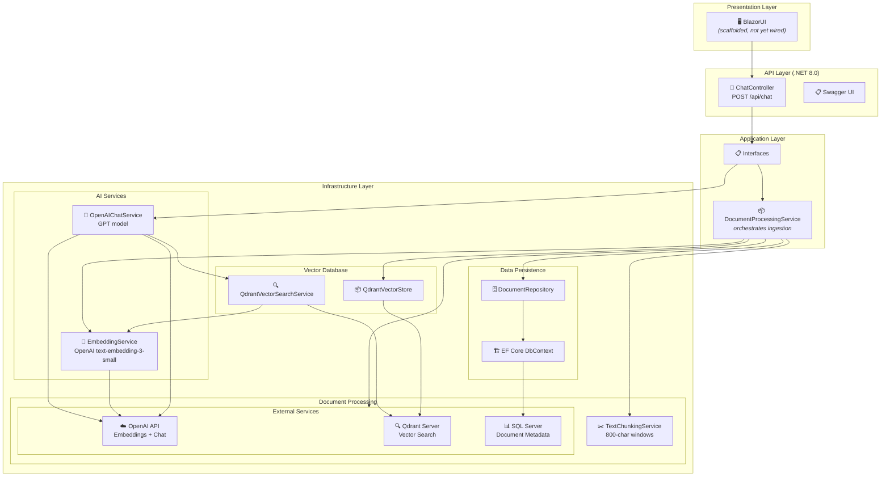
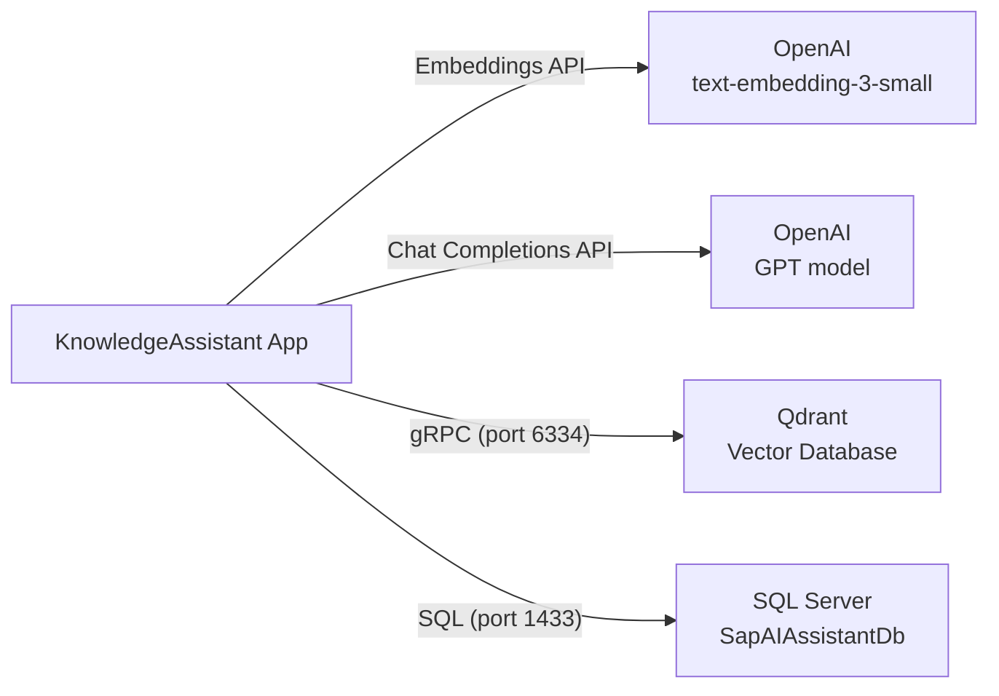

# Dataflow Diagrams

This document visualizes how data moves through the KnowledgeAssistant RAG application.  
These diagrams render as images on GitHub and any Mermaid-compatible viewer (VS Code, Obsidian, etc.).

---

## 1. Document Processing Flow (Ingestion Pipeline)

How a PDF document gets ingested, chunked, embedded, and stored.

```mermaid
sequenceDiagram
    actor U as 👤 User / Admin
    participant API as 🖥️ API / Caller
    participant DPS as 📦 DocumentProcessingService
    participant REPO as 🗄️ DocumentRepository
    participant DB as 📊 SQL Server
    participant PDF as 📄 PdfExtractionService<br>(PdfPig)
    participant CHK as ✂️ TextChunkingService
    participant EMB as 🧠 EmbeddingService<br>(OpenAI)
    participant QD as 🔍 QdrantVectorStore

    Note over U,API: Document already exists in DB<br>(upload not yet implemented)

    U->>API: ProcessDocumentAsync(documentId)
    API->>DPS: ProcessDocumentAsync(documentId)
    DPS->>REPO: GetDocumentByIdAsync(id)
    REPO->>DB: SELECT * FROM Documents WHERE Id = @id
    DB-->>REPO: Document entity
    REPO-->>DPS: Document (FileName, FilePath)

    DPS->>PDF: ExtractTextAsync(filePath)
    PDF->>PDF: Open PDF with PdfPig<br>Read all pages
    PDF-->>DPS: Full extracted text

    DPS->>CHK: ChunkText(text, size=800)
    CHK->>CHK: Split into 800-char chunks
    CHK-->>DPS: List&lt;string&gt; chunks

    loop For each chunk
        DPS->>EMB: GenerateEmbeddingAsync(chunk)
        EMB->>EMB: Call OpenAI<br>text-embedding-3-small
        EMB-->>DPS: float[1536] vector

        DPS->>QD: UpsertAsync(docId, index, chunk, vector)
        QD->>QD: Store point with<br>payload &amp; vector
        QD-->>DPS: OK
    end

    DPS-->>API: Processing complete
    API-->>U: ✅ Document indexed successfully
```

---

## 2. Question Answering Flow (Query Pipeline)

How a user question retrieves relevant context and generates an answer.

```mermaid
sequenceDiagram
    actor U as 👤 User
    participant API as 🖥️ ChatController
    participant CS as 💬 OpenAIChatService
    participant EMB as 🧠 EmbeddingService<br>(OpenAI)
    participant QD as 🔍 QdrantVectorSearchService
    participant QDB as 📦 Qdrant DB
    participant GPT as 🤖 OpenAI Chat<br>(GPT Model)

    U->>API: POST /api/chat<br>{"question": "How to..."}
    API->>CS: AskAsync(question)

    CS->>QD: SearchAsync(question, topK=5)
    QD->>EMB: GenerateEmbeddingAsync(question)
    EMB->>EMB: Call OpenAI<br>text-embedding-3-small
    EMB-->>QD: float[1536] query vector

    QD->>QDB: Search("documents", vector, limit=5)
    QDB->>QDB: Cosine similarity search<br>across all document chunks
    QDB-->>QD: Top 5 matching points

    QD->>QD: Extract payload.content<br>from each match
    QD-->>CS: List&lt;VectorSearchResult&gt;<br>(Content, Score, DocId)

    CS->>CS: Build RAG prompt:<br>System: "You are an SAP B1 assistant"<br>Context: [retrieved chunks]<br>Question: [user question]

    CS->>GPT: CompleteChatAsync(prompt)
    GPT->>GPT: Generate answer from context
    GPT-->>CS: ChatCompletion response

    CS-->>API: Answer string
    API-->>U: {"question": "...", "answer": "..."}
```

---

## 3. Component Architecture

The Clean Architecture layers and how they connect.



---

## 4. Key Data Structures

| Data | Shape | Storage |
|------|-------|---------|
| **Document metadata** | `Id, FileName, FilePath, UploadedAt, UploadedBy` | SQL Server |
| **Document chunks** | `Id, DocumentId, ChunkIndex, PageNumber, Content` | SQL Server |
| **Embedding vector** | `float[1536]` (text-embedding-3-small) | Qdrant |
| **Qdrant point payload** | `documentId, chunkIndex, content` | Qdrant |
| **Search result** | `Content, DocumentId, ChunkIndex, Score` | In-memory (DTO) |
| **Chat request/response** | `{ question, answer }` | In-memory (HTTP) |

---

## 5. External Service Dependencies



---

## Notes

- **Embedding dimension**: 1536 (OpenAI `text-embedding-3-small`)
- **Qdrant collections**: `QdrantVectorStore` stores in `sapb1_docs` (auto-created on startup), but `QdrantVectorSearchService` searches `documents` — ⚠️ **this is a known bug** (collection name mismatch)
- **Chunk size**: 800 characters (simple fixed-window chunking)
- **Similarity metric**: Cosine distance
- **Top-K retrieval**: 5 most relevant chunks per query
- **RAG prompt**: System prompt enforces answering only from provided context — prevents hallucination
- **Document upload**: Not yet implemented as an API endpoint — `ProcessDocumentAsync` expects the document to already exist in the database
